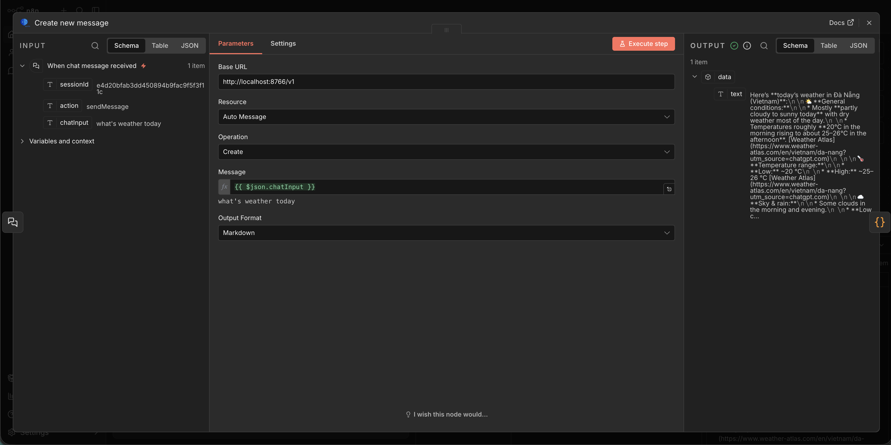

# n8n-nodes-browcall-gate

This is an n8n community node that allows you to integrate **[Browcall Gate](https://github.com/gys-dev/browcall-gate)** directly into your n8n workflows. It acts as a bridge, enabling n8n to communicate with the Browcall Extension via the `gpt-auto-api` backend.

<p align="center">
  
</p>

## 🚀 Overview

The **Browcall Gate** node allows n8n workflows to "call" AI chat interfaces like ChatGPT or Perplexity. This is achieved by:
1. Sending a request from n8n to the `gpt-auto-api`.
2. The API forwarding the request to the active browser extension via WebSockets.
3. The extension executing the prompt in the browser and returning the result back to n8n.

## ⚙️ Features

- **Direct AI Integration**: Prompt ChatGPT or Perplexity directly from your workflow.
- **Custom Output Formats**: Supports `text`, `markdown`, and `json` outputs.
- **Dynamic Base URL**: Easily switch between local and production instances of the `gpt-auto-api`.
- **Tool-Compatible**: Can be used as a tool within larger AI agent workflows in n8n.

## 🛠 Local Installation (Development)

Since this node is currently only available locally, follow these steps to integrate it into your n8n instance:

### 1. Build the Node
Navigate to this directory and build the typescript files:
```bash
cd packages/n8n-nodes-browcall-gate
npm run build
```

### 2. Link the Node to n8n
You need to make this package available to your local n8n installation.

**In this directory:**
```bash
npm link
```

**In your n8n installation directory (where n8n is installed, e.g., `~/.n8n` or your n8n source folder):**
```bash
npm link n8n-nodes-browcall-gate
```

### 3. Restart n8n
Restart your n8n process. The "Browcall Gate" node should now appear in your nodes list.

## 📦 Distribution
*Note: This node is currently in local development and not yet available on the npm registry.*

## 📖 Node Configuration

### Parameters
| Parameter | Description | Default |
| :--- | :--- | :--- |
| **Base URL** | The URL where your `gpt-auto-api` is running. | `http://localhost:8766/v1` |
| **Resource** | Currently supports `Auto Message`. | `message` |
| **Operation** | The action to perform (e.g., `Send Prompt`). | `chat` |
| **Message** | The text prompt you want to send to the AI. | - |
| **Format** | The format of the returned data (`text`, `markdown`, or `json`). | `text` |

## 🎬 Example Usage

1. **Start the API**: Ensure `npm run serve` is running in the project root.
2. **Open n8n**: Add the **Browcall Gate** node.
3. **Configure**: Set the Base URL to your API address and enter your prompt.
4. **Execute**: The node will trigger the browser extension and return the AI's response in your defined format.

## 📄 License

[MIT](LICENSE)
